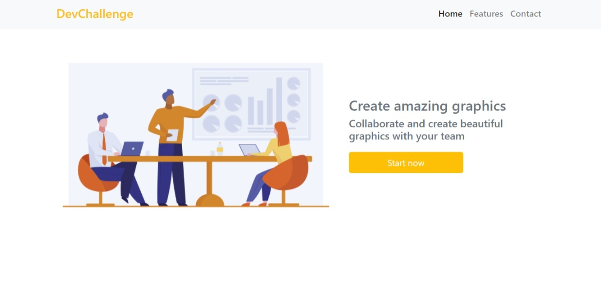

# AmazingGraph

## 🚀 Tecnologias utilizadas

O projeto foi desenvolvido utilizando as seguintes tecnologias:

- HTML
- Bootstrap

## 💻 Projeto

projeto feito para conhecer e praticar Bootstrap basicamente so o basico de um layout de uma pagina de criação de graficos 
